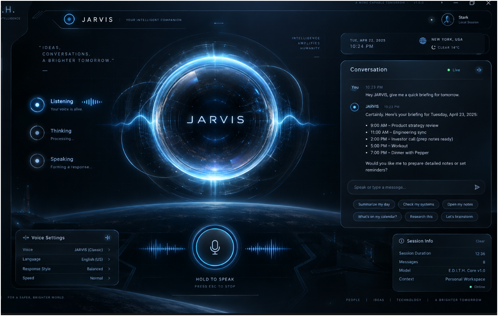

# E.D.I.T.H. Chat 6 Phase 8C Native / Release Freeze Handoff

Date: 2026-09-28

OWNER: Chat 6 - Computer Use / Browser / Voice / Desktop Safety

SCOPE: Native/Tauri integration freeze, cross-device native publication, lifecycle safety, and Windows release verification. No new product capability was enabled.

STATUS: CONDITIONALLY COMPLETE. Source, contract, full-package freshness, release-build, portable, and packaged-runtime checks pass after one final rebuild against the Phase 8A/8B/8D freeze inputs. Production release remains blocked by missing Authenticode signatures. The fresh `tauri:dev` smoke was not accepted because localhost services timed out before a native window formed; its owned process tree was cleaned up.

COMMITS: None. The shared dirty worktree was preserved without reset, cleanup, or commit.

## Visual Reference

The user-supplied JARVIS image is retained as the Voice Room composition reference:

SHA-256: `8DA85A8700CE4782C492BBF19BC1AB9A8EDE538592D869F4769DD5FD2C1DE654`

This image is a design reference only. It is not presented as a real screenshot, live OCR result, device state, or computer-control result. Real Voice Room status and transcript data must continue to come from the existing runtime services.

## Files Changed In Phase 8C

- `src-tauri/src/cross_device.rs`
- `scripts/test-edith-desktop-release.mjs`
- `scripts/test-edith-phase8c-native-freeze.ts`
- `docs/assets/edith-voice-room-jarvis-reference-2026-09-28.png`
- `docs/EDITH_CHAT6_PHASE8C_NATIVE_RELEASE_FREEZE_HANDOFF_2026-09-28.md`

Generated release and portable artifacts were refreshed under `src-tauri/target/release` and `artifacts/desktop`.

## Proven Integration Regressions Fixed

1. Native producer bootstrap deadlock:
   - Phase 7E correctly required a successful accepted ingest before reporting the control plane connected.
   - Phase 6F required that connected state before it allowed the first PC status sample.
   - Native bootstrap now builds a real, bounded PC status record and publishes it through the fixed native route.
   - Bootstrap succeeds only after backend `202` plus `success: true`; failure revokes the native producer session.

2. Stale release acceptance:
   - Release freshness previously tracked only a subset of native inputs.
   - It now tracks scoped frontend, backend/shared-service, native, crypto-resource, and packaging inputs.
   - Desktop EXE, backend sidecar, MSI, NSIS, and portable ZIP are checked independently against their relevant source sets.
   - Portable desktop/sidecar hashes and the complete frontend `dist` tree are compared with current release/build outputs.

3. Windows release-smoke process inventory:
   - The harness queried every Windows process and repeatedly timed out in CIM teardown.
   - Inventory is now restricted to `edith.exe` and `edith-backend.exe`, then explicitly exits PowerShell after JSON output.
   - Packaged launch, owned sidecar restart, single-instance behavior, and normal-close cleanup all passed.

## Security Model Verified

- Generic WebView callers cannot spoof trusted-native advanced publication.
- Producer bearer and sequence state remain native-only and are not returned to JavaScript.
- Exact-next sequence advances only after backend `202` with `success: true`.
- Owner rotation, expiry, kill switch, publication failure, and app exit revoke native sessions.
- Sensitive-app denylist and foreground-window race checks fail closed.
- Restore launch remains allowlisted; shells and arbitrary executable references remain rejected.
- Sidecar ownership is tied to the desktop app and bounded restart behavior remains active.
- Normal packaged-app close leaves no observed E.D.I.T.H. descendants.
- Tauri capabilities and CSP remain minimal. No unsafe OS permission was added.
- Computer Use and Browser Use remain read-only by default.
- Screenshot/OCR, wake word, global shortcuts, tray/background mode, and uncontrolled device control remain disabled.

## Verification Results

PASS:

- `cargo fmt --manifest-path src-tauri/Cargo.toml -- --check`
- `cargo check --manifest-path src-tauri/Cargo.toml`
- `cargo clippy --manifest-path src-tauri/Cargo.toml --lib --tests -- -D warnings`
- `cargo test --manifest-path src-tauri/Cargo.toml` - 35 passed
- `npx tsx scripts/test-edith-phase8c-native-freeze.ts` - 11 checks passed
- Computer Use, interaction-safety, Phase 6B/6E/6F/6G, Phase 7A/7B/7C/7D/7E/7F, contract-adapter, backend-security suites
- `npm run lint`
- `npm run build` (only the existing Vite large-chunk warning)
- `npm run tauri:build` using the already-vetted portable Python runtime as `EDITH_CRYPTO_PYTHON_BUNDLE_DIR`
- `npm run desktop:portable`
- `npm run desktop:portable:verify` - 11,437 files, PASS
- `npm run test:edith-portable-security` - all malicious ZIP fixtures rejected, PASS
- Packaged release runtime: launch, managed sidecar ownership, bounded sidecar restart, single instance, and clean normal close all PASS
- Final package freshness: desktop EXE, backend sidecar, MSI, NSIS, and portable ZIP all postdate the newest scoped input, `src/edith/advancedExperienceClient.ts` at `2026-09-28T16:50:11.551Z`.
- Portable hash parity: desktop EXE and backend sidecar match release outputs; the four-file frontend tree matches current `dist` with tree SHA-256 `51a0dd97086af979e6c9e5249a02978da2eb1c374791c6de4c9928d04937fdf8`.
- Frontend tree parity is intentionally scoped to Vite output (`index.html` and `assets/**`). A later generic `npm run build` may add `server.cjs` and its source map to root `dist`; those backend bundle files are represented by the packaged sidecar and are not portable frontend files.

DEGRADED / BLOCKED:

- First package attempt correctly failed closed without `EDITH_CRYPTO_PYTHON_BUNDLE_DIR`.
- Fresh `npm run tauri:dev` began its owned Vite/backend chain, but localhost `5173` and `3000` requests timed out and no native window formed. The owned process tree was stopped and both ports were verified clear. This is not counted as a successful dev smoke.
- Final release smoke result is `EXTERNAL_BLOCKER`, with 25 PASS, 0 FAIL, and exactly 4 unsigned-artifact blockers.

## Final Package Freshness Follow-up

- Phase 8A, Phase 8B, and Phase 8D handoffs were read before the final check.
- The pre-rebuild audit proved that the backend sidecar and MSI predated the final Phase 8D frontend input. The package set was therefore treated as stale even though the old packaged runtime lifecycle still passed.
- Exactly one fresh `npm run tauri:build` was completed with the existing lock-verified portable Python runtime supplied through `EDITH_CRYPTO_PYTHON_BUNDLE_DIR`.
- Exactly one fresh `npm run desktop:portable` was completed after that release build.
- `npm run desktop:portable:verify`, `npm run test:edith-portable-security`, the expanded release smoke, `npm run lint`, and the Phase 8C native freeze test passed after regeneration.
- Android sources and handoff documents are not desktop package inputs. No Android rebuild or product feature change was performed in this follow-up.

## Current Artifacts

- `src-tauri/target/release/edith.exe`
  - Bytes: `16,932,864`
  - SHA-256: `86bd5d94928bfe24f0b9eb76d2b17487f3d3842bc3952775ef5b69f66ba779e1`
  - Authenticode: `NotSigned`
- `src-tauri/target/release/edith-backend.exe`
  - Bytes: `50,657,973`
  - SHA-256: `d10caad0ebca9108163a7a97c5fd5d62fd04f9e77e967fe4950fc3014dce29d4`
  - Authenticode: `NotSigned`
- `src-tauri/target/release/bundle/msi/E.D.I.T.H._1.0.0_x64_en-US.msi`
  - Bytes: `149,554,012`
  - SHA-256: `8458fbc57e643eb0a327ee5c3236d52c85adaab5d4262480ddf495ad3737d626`
  - Authenticode: `NotSigned`
- `src-tauri/target/release/bundle/nsis/E.D.I.T.H._1.0.0_x64-setup.exe`
  - Bytes: `99,924,390`
  - SHA-256: `9c11d5e9a3539ee13d0ac5b6e445553986284cf209aac57549ef7b650b7bf48c`
  - Authenticode: `NotSigned`
- `artifacts/desktop/E.D.I.T.H.-1.0.0-windows-x64.zip`
  - Bytes: `151,696,015`
  - SHA-256: `2c6ad88912488e885b0ffb5871353d2f7dff051f9317cd44e745f79a9043f161`
  - Authenticode: not applicable to ZIP; PowerShell reports `UnknownError` rather than a signature.

## Remaining Blockers

1. Sign the app EXE, sidecar EXE, MSI, and NSIS installer with the approved production certificate, then rerun `npm run smoke:edith-desktop-release`.
2. Re-run `npm run tauri:dev` in a clean local session and collect a native-window smoke after both ports answer. Do not share an unrelated browser-only backend because the desktop bridge token boundary intentionally rejects it.
3. Do not claim the supplied JARVIS reference as implemented pixel-for-pixel UI or live evidence. Chat 2 owns any future visual convergence while preserving real state wiring.

## Downstream Notes

- Chat 2: use the retained JARVIS image only as the Voice Room visual reference. Keep actual listening/thinking/speaking/transcript state bound to real services.
- Release owner: provide the vetted Python runtime explicitly for package builds and provide production code-signing material outside the repository.
- Integration QA: repeat native dev smoke on a quiet host/session; packaged runtime evidence is already green.

DO_NOT_TOUCH:

- Do not weaken trusted-native publication boundaries.
- Do not expose producer bearer/sequence state to JavaScript.
- Do not enable screenshot/OCR, wake word, global shortcuts, tray/background mode, browser automation, or uncontrolled mouse/keyboard control.
- Do not bypass the vetted Python prerequisite or Authenticode blocker.
- Do not reset, clean, or commit the shared dirty worktree without coordination.
